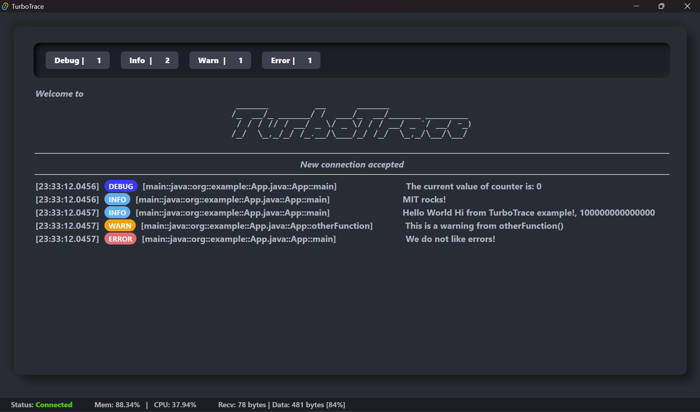

# TurboTrace

  

A log compression tool that includes:

- A client to view logs.
- A Java library for sending logs.
- A preprocessor Gradle plugin at the core of compressing the logs.

## How It Works

The TurboTrace Gradle preprocessor plugin optimizes log handling in the following steps:

1. **Backup the Source Code**: Before making any modifications, the original source code is backed up to ensure it can be restored after optimization.

2. **Log Call Optimization**:
   - The plugin scans the source code to find all log calls and replaces them with a more optimized version.
   - Static strings and constants within the log calls are removed, and the details are saved in a `logtypes.json` file, along with a unique ID for each log call.
   - This allows the logs to be referenced by their unique ID during runtime, significantly reducing log size.

3. **Compilation with Optimized Code**: The modified source code is compiled with the optimizations in place, reducing the amount of log data generated.

4. **Restoring the Source Code**: Once the compilation is complete, the original source code is restored from the backup.

## Prerequisites

Before installing and using TurboTrace, ensure the following prerequisites are met:

- **Java Development Kit (JDK)**: Required for Java-based development. [Download JDK](https://www.oracle.com/java/technologies/javase-downloads.html)
- **Rust**: If your project involves Rust components. [Install Rust](https://www.rust-lang.org/tools/install)
- **Gradle**: Required for building the project. [Install Gradle](https://gradle.org/install/)
- **VSCode**: Recommended for development. [Download VSCode](https://code.visualstudio.com/)
